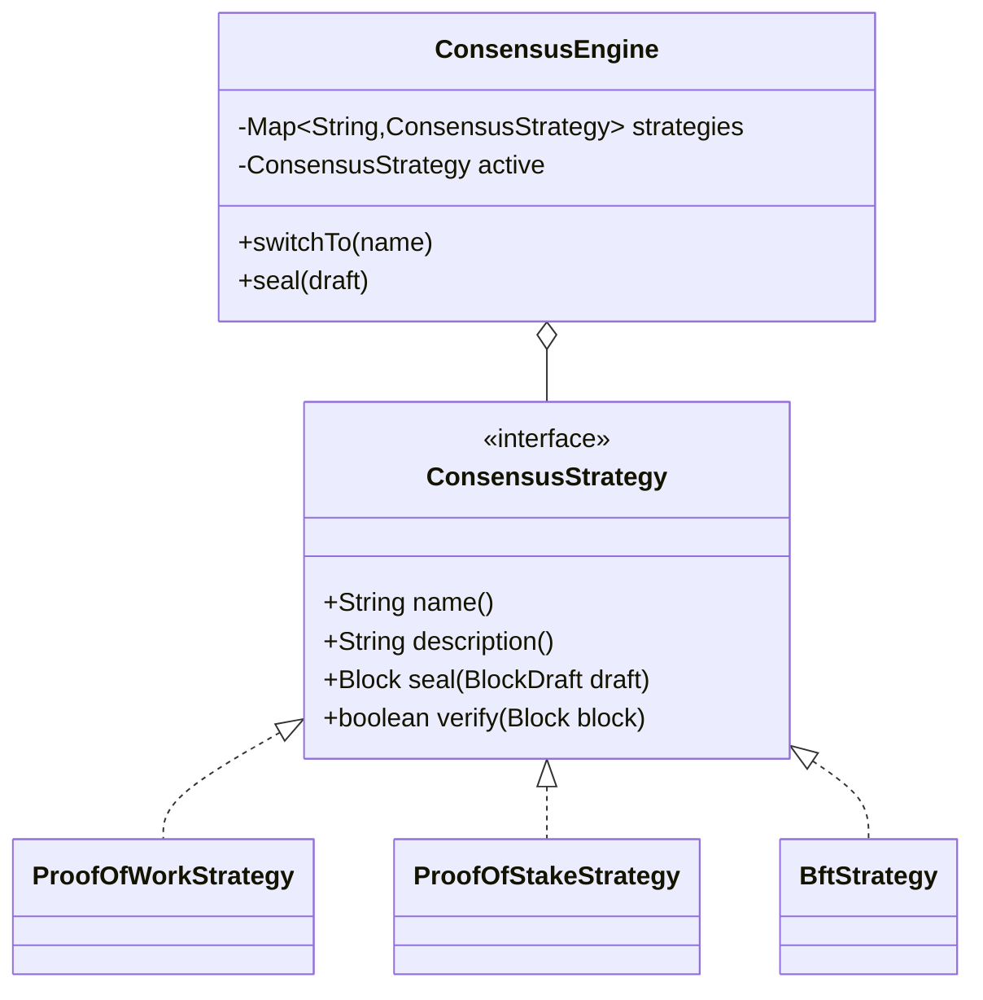

# LegalChain — Backend Requirements (SDLC Doc 03)

**Stack:** Java 21 (records, virtual threads), Spring Boot 3.5, BouncyCastle PQC, Spring WebSocket.
**Author role:** Enterprise System Architect (handing off to Lead Java Blockchain Engineer — ROLE 2).
**Cross-cutting:** the backend must serve both language dictionaries via `GET /api/i18n/{lang}` so the SPA's PL/EN flag switcher (🇬🇧/🇵🇱) works without redeploy.

---

## 1. Post-Quantum Cryptography architecture

### 1.1 Algorithms (NIST-standardized)

| Concern | Algorithm | Standard | BouncyCastle JCA name |
|---|---|---|---|
| Digital signatures (transactions, blocks, handshake) | ML-DSA-65 (CRYSTALS-Dilithium) | **FIPS 204** | `ML-DSA` + `MLDSAParameterSpec.ml_dsa_65` |
| Key encapsulation (P2P session keys) | ML-KEM-768 (CRYSTALS-Kyber) | **FIPS 203** | `ML-KEM` via `javax.crypto.KEM` (JEP 452, Java 21) |
| Hashing (block hash, Merkle root, address derivation) | SHA3-256 | FIPS 202 | `SHA3-256` |
| Symmetric channel | AES-256-GCM | FIPS 197 / SP 800-38D | `AES/GCM/NoPadding` |

Register `BouncyCastleProvider` once at startup (a `@Configuration` static initializer). **Do not** rely on JDK-24 built-in ML-KEM/ML-DSA — the course targets Java 21 portability.

### 1.2 Services

- `PqcSignatureService` — key pair generation, `sign(byte[])`, `verify(pubKey, data, sig)`. Javadoc must explain why lattice signatures survive Shor's algorithm while ECDSA does not.
- `PqcKeyExchangeService` — ML-KEM encapsulation/decapsulation + HKDF-style derivation of the AES-256-GCM session key. Javadoc must explain the QKD analogy: like QKD, each session gets a *fresh, jointly-derived, never-transmitted* key; unlike QKD, security rests on lattice hardness instead of photon physics.
- `HashUtil` — SHA3-256 hex digests, Merkle root computation.
- Wallet address = `SHA3-256(publicKeyEncoded)` truncated (e.g., first 20 bytes, hex) — pseudonymous SSI-style identifier.

### 1.3 QKD-inspired channel rules

1. New ML-KEM encapsulation per WebSocket session — no long-lived symmetric keys.
2. Handshake transcript signed with ML-DSA by both sides (MITM defense).
3. Unique 96-bit GCM nonce per frame; session terminated on any auth-tag failure (tamper-evidence, mirroring QKD's disturbance detection).

## 2. Blockchain Core & Ledger

- `Block` and `Transaction` are **Java records** (immutable). Block hash = SHA3-256 over `index‖timestamp‖previousHash‖merkleRoot‖validatorId‖nonce‖proof`.
- Genesis block is deterministic (fixed timestamp/content) so two fresh nodes share a common root and can sync.
- Mempool: thread-safe pending pool; transactions verified (signature + funds) on admission.
- Validation: `validateChain()` re-checks hash linkage, Merkle roots, per-transaction signatures, and consensus proof of every block.
- **Tokenomics:** REWARD transaction per mined block. Initial reward 50 LGC; halves every N blocks (configurable, default 10); hard cap enforced (default 21,000 LGC); balances derived exclusively by replaying the chain.

## 3. Node management

- Each process is one node: identity = wallet fingerprint; configuration via `application.yml` + `--server.port` override for the second node.
- `NodeRegistry` tracks connected peers `{nodeId, url, fingerprint}`.
- `GET /api/node` exposes node id, port, active consensus, peers, chain length.
- All request handling and P2P I/O on **virtual threads** (`spring.threads.virtual.enabled=true`; `Executors.newVirtualThreadPerTaskExecutor()` for the P2P client).

## 4. Consensus — Strategy pattern



**Implemented (executable):**
- **PoW** — leading-zero SHA3 puzzle with modest difficulty (educational, visibly slower).
- **PoS** — validator selected deterministically weighted by on-chain stake (balance); proof records the stake snapshot. Slashing documented as Phase 2.
- **BFT (emphasized)** — simulated 4-validator PBFT round (pre-prepare/prepare/commit); proof records the ≥2f+1 vote set; tolerates f < n/3 faulty validators. Javadoc must explain why BFT finality suits permissioned, compliance-oriented ledgers.

**Documented conceptually (strategy descriptions + frontend encyclopedia):** Hybrid, DPoS, PoReputation, PoUtility, PoH, PoET.

Active strategy is hot-swappable via `POST /api/consensus {strategy}` and reported in each block's `consensusType`.

## 5. Smart Contract engine (Blockchain 3.0)

`SmartContract` interface: `id()`, `execute(ContractContext) → ContractResult`; every execution is recorded as a typed transaction (CONTRACT_MEDICAL / CONTRACT_AGRI) so contract state is fully reconstructible from the ledger.

- **MedicalConsentContract** — consent-based patient history access: grant/revoke `{patientId (pseudonym), granteeId, scope, granted}`. GDPR rule: *only consent decisions and hashes on-chain; never clinical data.* Current consent state = replay of the patient's contract transactions.
- **AgriSupplyChainContract** — supply-chain transparency: append-only events `{batchId, stage (HARVEST→TRANSPORT→PROCESSING→RETAIL), actor, location, details}`; the ledger provides farm-to-fork provenance.

## 6. P2P synchronization (2 remote nodes)

- Transport: **WebSocket** endpoint `/ws/p2p` (client via standard `WebSocketClient` on virtual threads).
- Handshake per doc 01 §4.2 (ML-DSA signatures + ML-KEM encapsulation → AES-256-GCM channel).
- Protocol messages (encrypted after handshake): `CHAIN_REQUEST`, `CHAIN_RESPONSE`, `NEW_BLOCK`, `NEW_TX`.
- Conflict resolution: **longest fully-valid chain wins**; the adopted chain is completely re-validated (hashes, signatures, proofs) before replacement.
- Javadoc requirement (from CLAUDE.md ROLE 2): explain in code how signed-handshake + KEM establishes trust between parties **without revealing full identities** (pseudonymous fingerprints, proof of key possession — a ZKP-flavored property).

## 7. Internationalization

`GET /api/i18n/{lang}` returns the flat string dictionary for `en` or `pl` (backed by `messages_en.properties` / `messages_pl.properties`). Educational long-form texts may live in the SPA bundle, but every backend-sourced label must come from these bundles so the flag switcher covers the whole UI.

## API Contract (agreed, v1)

```
Base URL: http://localhost:8080

GET  /api/node                 -> {nodeId, name, port, consensus, peers:[{nodeId,url}], chainLength}
GET  /api/chain                -> {length, valid, blocks:[Block]}
GET  /api/chain/validate       -> {valid, message}
POST /api/chain/mine           {validatorId?} -> Block
GET  /api/transactions/pending -> [Transaction]
POST /api/transactions         {recipient, amount, memo?} -> Transaction (signed with node wallet ML-DSA key)
GET  /api/wallet               -> {address, algorithm, publicKey, fingerprint, balance}
GET  /api/wallet/balances      -> {address: balance, ...}
GET  /api/consensus            -> {active, available:[{name, description}]}
POST /api/consensus            {strategy} -> {active}
POST /api/nft/mint             {title, description, metadataUri} -> Nft
GET  /api/nft                  -> [Nft]
POST /api/contracts/medical/consent {patientId, granteeId, scope, granted} -> ContractResult
GET  /api/contracts/medical/{patientId} -> [ConsentRecord]
POST /api/contracts/agri/event {batchId, stage, actor, location, details} -> ContractResult
GET  /api/contracts/agri/{batchId} -> [SupplyChainEvent]
POST /api/p2p/connect          {url} -> {connected, peer}
POST /api/p2p/sync             -> {result, chainLength}
GET  /api/i18n/{lang}          -> flat map of UI strings (lang: en|pl)
WS   /ws/events                -> pushes {type: BLOCK_ADDED|TX_ADDED|PEER_CONNECTED|CHAIN_REPLACED|CONSENSUS_CHANGED, data}
WS   /ws/p2p                   -> node-to-node channel (ML-DSA-signed handshake, ML-KEM encapsulation, AES-256-GCM)

Block JSON:       {index, timestamp, previousHash, hash, merkleRoot, validatorId, consensusType, proof, nonce, transactions[]}
Transaction JSON: {id, timestamp, sender, recipient, amount, type: TRANSFER|REWARD|NFT_MINT|CONTRACT_MEDICAL|CONTRACT_AGRI, payload, senderPublicKey, signature}
```

## 8. Non-functional requirements

| NFR | Requirement |
|---|---|
| Code quality | Java records for domain, virtual threads for I/O, Javadoc explaining *why compliant & secure* on every crypto/consensus/P2P class. |
| Testing | Unit tests: chain integrity & tamper detection, ML-DSA sign/verify roundtrip, ML-KEM shared-secret agreement, consensus seal/verify, contract replay. |
| Observability | Every ledger mutation emits a `/ws/events` frame; server logs handshake fingerprints (never keys). |
| Performance | Mining PoW difficulty tuned so a block seals < 2 s on a laptop (educational responsiveness). |
| Security | No private key ever leaves the process; no personal data on-chain; CORS restricted to the SPA origin in dev. |
