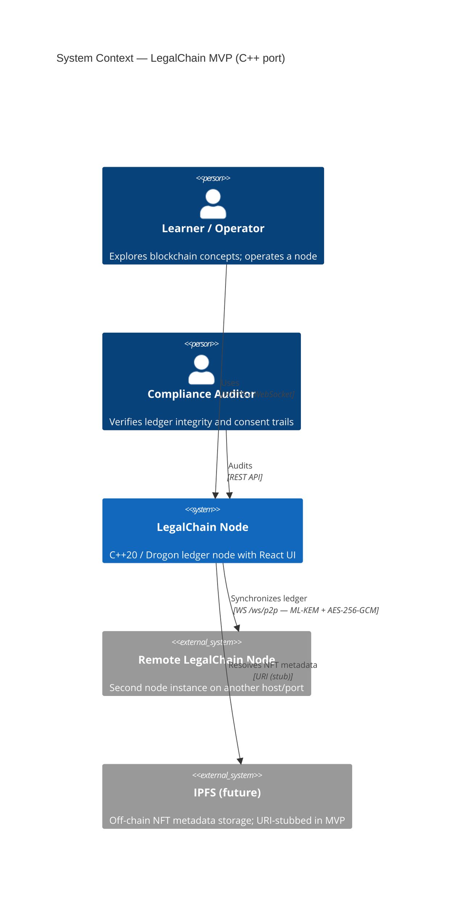
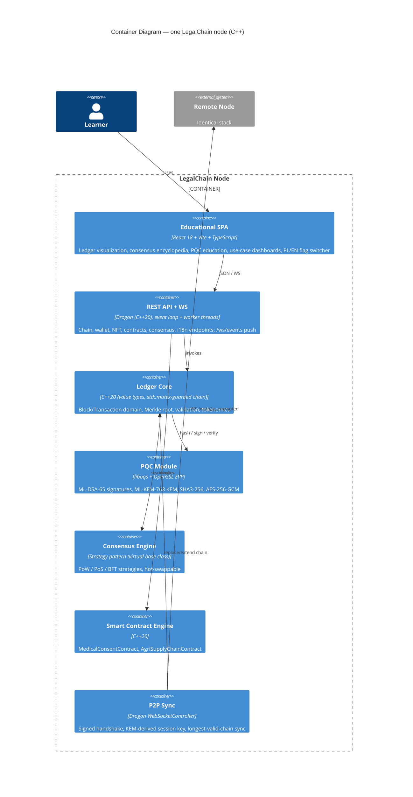
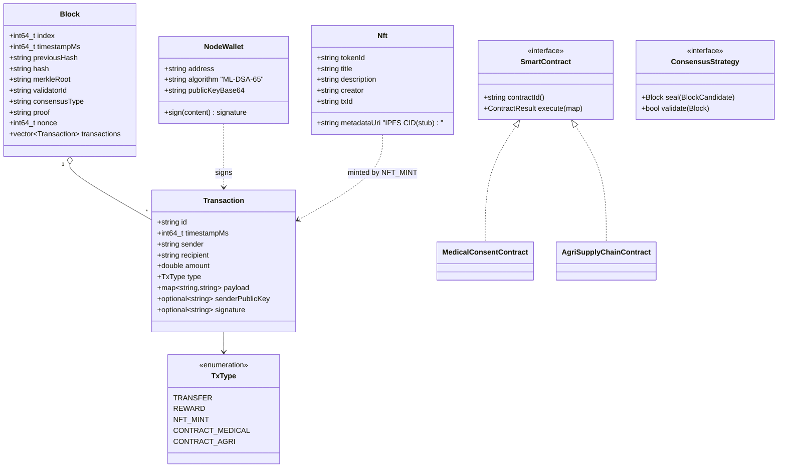
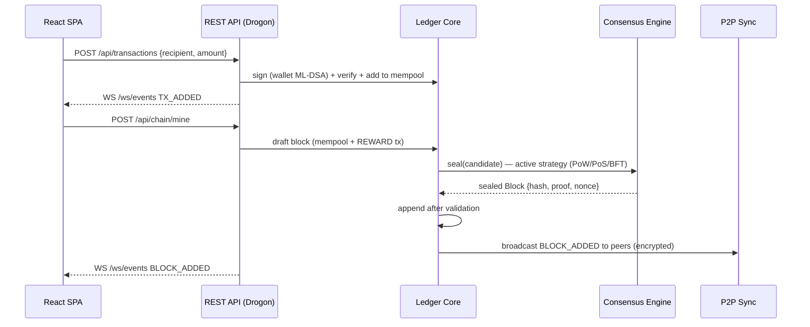

# LegalChain — System Architecture (SDLC Doc 01)

**Product:** LegalChain — a compliant, educational Blockchain 3.0 MVP (general ledger, NFT, Smart Contracts, PQC)
**Author role:** Enterprise System Architect & Product Owner
**Status:** Approved for implementation
**Mandatory cross-cutting requirement:** the UI ships with a PL/EN language switcher (🇬🇧/🇵🇱 flag toggle) — see [04-frontend-requirements.md](04-frontend-requirements.md).

---

## 1. System Context

LegalChain is an educational, functional (non-mock) distributed general ledger demonstrating Blockchain 3.0 concepts — post-quantum cryptography, pluggable consensus, Smart Contracts for regulated sectors (medicine, agriculture), NFT-based ownership certification, and privacy-preserving two-node synchronization. This document describes the **C++ port** of the reference Java/Spring Boot implementation (`app01_java_block`): same domain model, same REST/WS contract, same security properties — reimplemented in C++20 on Drogon so the existing React frontend can be reused unmodified against it.



### 1.1 Compliance drivers

| Regulation | Architectural consequence |
|---|---|
| **GDPR** | No personal data on-chain. Medical contracts store *consent decisions and hashes*, never patient history payloads. Right-to-erasure is preserved because on-chain records are pseudonymous references to off-chain data. |
| **eIDAS 2.0** | Wallet identity is designed to map onto SSI/DID (EUDI Wallet) in a later phase; MVP uses ML-DSA key fingerprints as pseudonymous identifiers. |
| **MiCA** | The token is a closed-loop *utility/educational* token (no fiat on/off ramp), keeping the MVP outside licensable crypto-asset service scope while demonstrating compliant tokenomics (capped supply, transparent issuance). |
| **NIS2 / cybersecurity** | NIST-standardized PQC (FIPS 203/204), authenticated encrypted channels, deterministic auditability of every state change. |

## 2. Container & Component Architecture



### 2.1 Technology decisions (ADR summary)

| Decision | Choice | Rationale |
|---|---|---|
| Language/standard | **C++20** | `std::mutex`-guarded value types give the same tamper-evidence-by-construction as Java records (copy-on-read snapshots, no shared mutable state escaping the ledger); `std::jthread` for cooperative-cancellable background work. |
| Framework | **Drogon** (`libdrogon-dev`) | Controller/macro-based routing analogous to `@RestController`, native `WebSocketController`, coroutine-friendly async I/O, built on a small, fast event loop (trantor). |
| PQC | **liboqs (ML-DSA, ML-KEM)** | The reference C implementation of NIST FIPS 204 / FIPS 203, built via CMake `FetchContent`; same algorithm families and parameter sets as the Java port (ML-DSA-65, ML-KEM-768), so the security story is identical across languages even though the two ports are not wire-interoperable with each other. |
| Frontend | **React 18 + Vite + TypeScript** (reused from `app01_java_block/frontend`) | See justification in doc 04; the SPA talks to a generic JSON/WS contract, so it needs no rewrite — only a backend proxy-port change. |
| Transport | **WebSockets** (REST for commands) | Full-duplex ledger events; gRPC deferred (doc 05). |
| Persistence | **In-memory chain (MVP)** | Educational focus; the chain itself is the audit log. File/DB snapshotting is a Phase-2 item. |

## 3. Data Model (core domain)



Design invariants:

- **Immutability:** domain types are constructed once and passed by value/`const&`; a block's `hash` covers `index‖timestamp‖previousHash‖merkleRoot‖validatorId‖consensusType‖proof‖nonce`, so any mutation invalidates the chain.
- **Merkle root:** transactions are Merkle-hashed (SHA3-256) so a single transaction cannot be altered without changing the block hash.
- **Every state change is a transaction:** NFT mints and contract executions are recorded as typed transactions — the ledger *is* the audit trail (transparency requirement).

## 4. Security Architecture

### 4.1 Cryptographic suite

| Purpose | Algorithm | Standard | liboqs / OpenSSL identifier |
|---|---|---|---|
| Transaction & handshake signatures | **ML-DSA-65 (Dilithium)** | NIST FIPS 204 | `OQS_SIG_alg_ml_dsa_65` |
| Session key establishment | **ML-KEM-768 (Kyber)** | NIST FIPS 203 | `OQS_KEM_alg_ml_kem_768` |
| Hashing / Merkle / addresses | **SHA3-256** | FIPS 202 | OpenSSL EVP (`EVP_sha3_256`) |
| Channel encryption | **AES-256-GCM** | FIPS 197 / SP 800-38D | OpenSSL EVP (`EVP_aes_256_gcm`) |

### 4.2 P2P handshake (QKD-inspired, MITM-resistant)

The design borrows QKD's core discipline — *fresh, ephemeral session keys whose establishment is verifiable by both parties* — implemented with ML-KEM (software lattice KEM rather than photonic hardware):

```mermaid
sequenceDiagram
    participant A as Node A (initiator)
    participant B as Node B (responder)
    Note over A,B: WS /ws/p2p — plaintext only during authenticated handshake
    A->>B: HELLO {nodeId, kemPub, dsaPub, sig = ML-DSA(kemPub‖nodeId)}
    B->>B: verify sig against dsaPub; nodeId == SHA3-256(dsaPub) (fingerprint binding)
    B->>A: ENCAPS {ciphertext = ML-KEM.encapsulate(kemPub), dsaPub_B, sig_B}
    A->>A: sharedSecret = ML-KEM.decapsulate(ciphertext) -> AES-256-GCM key
    B->>B: sharedSecret (same, from encapsulation) -> AES-256-GCM key
    Note over A,B: All further frames are SECURE (AES-256-GCM); new key per session (forward secrecy)
    A->>B: SECURE{CHAIN_REQUEST} (encrypted)
    B->>A: SECURE{CHAIN_RESPONSE} (encrypted; every block re-validated on receipt)
```

**MITM resistance:** every handshake message is signed with ML-DSA, and the receiver checks that the claimed `nodeId` equals the SHA3-256 fingerprint of the signing key — an interceptor cannot substitute its own KEM key without forging a lattice-based signature. **Privacy preservation (ZKP-style):** nodes authenticate as *key fingerprints* (pseudonyms) — each party proves possession of a private key (by producing a valid signature) without revealing any real-world identity, which is the trust-without-disclosure property the user stories in doc 02 (Epic E4) require.

### 4.3 Threat model (STRIDE excerpt)

| Threat | Vector | Mitigation |
|---|---|---|
| Spoofing | Fake peer joins sync | ML-DSA-signed handshake + fingerprint-equals-nodeId check on every message |
| Tampering | Block/transaction mutation | SHA3-256 chain + Merkle root + full re-validation on chain replacement |
| Repudiation | Actor denies a contract action | Every action is a signed on-chain transaction |
| Information disclosure | Traffic capture; **harvest-now-decrypt-later** | ML-KEM-768 + AES-256-GCM; per-session ephemeral keys, never persisted |
| MITM | Key substitution during handshake | Signatures over the full handshake payload (§4.2) |
| Denial of service | WS flood | Bounded worker-thread pool for mining, message size caps (Phase 2: rate limiting) |
| Consensus abuse | Malicious validator | BFT strategy tolerates f < n/3 faults; PoS slashing is documented in doc 03 |

## 5. Deployment topology (MVP)

Two identical Drogon node processes (`--port 8090` / `--port 8091`), each serving its own SPA build (or the shared Vite dev server) and wallet; peered via `POST /api/p2p/connect`. Longest-valid-chain rule resolves divergence. Ports are deliberately distinct from `app01_java_block` (8080/8081) so both language ports can run side by side. See doc 03 §Node Management.

## 6. Block lifecycle



## 7. Traceability

- Requirements → [06-implementation-checklist.md](06-implementation-checklist.md)
- Epics & stories → [02-epics-user-stories.md](02-epics-user-stories.md)
- Backend spec & API contract → [03-backend-requirements.md](03-backend-requirements.md)
- Frontend spec (incl. PL/EN flag switcher) → [04-frontend-requirements.md](04-frontend-requirements.md)
- Connectors & skills → [05-connectors-and-skills.md](05-connectors-and-skills.md)
