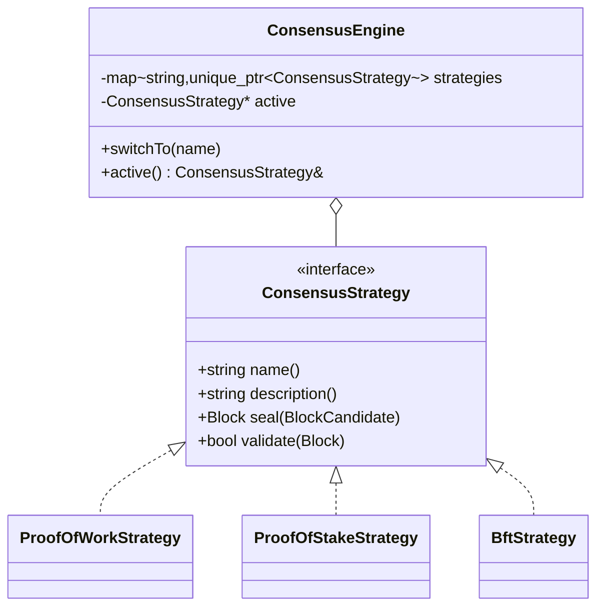

# LegalChain — Backend Requirements (SDLC Doc 03)

**Stack:** C++20, Drogon (HTTP + WebSocket), liboqs (PQC), OpenSSL EVP (hashing/AEAD), CMake + Ninja.
**Author role:** Enterprise System Architect (handing off to Lead C++ Blockchain Engineer — ROLE 2).
**Cross-cutting:** the backend must serve both language dictionaries via `GET /api/i18n/{lang}` so the SPA's PL/EN flag switcher (🇬🇧/🇵🇱) works without redeploy.

---

## 1. Post-Quantum Cryptography architecture

### 1.1 Algorithms (NIST-standardized)

| Concern | Algorithm | Standard | Library identifier |
|---|---|---|---|
| Digital signatures (transactions, blocks, handshake) | ML-DSA-65 (CRYSTALS-Dilithium) | **FIPS 204** | liboqs `OQS_SIG_alg_ml_dsa_65` |
| Key encapsulation (P2P session keys) | ML-KEM-768 (CRYSTALS-Kyber) | **FIPS 203** | liboqs `OQS_KEM_alg_ml_kem_768` |
| Hashing (block hash, Merkle root, address derivation) | SHA3-256 | FIPS 202 | OpenSSL EVP `EVP_sha3_256()` |
| Symmetric channel | AES-256-GCM | FIPS 197 / SP 800-38D | OpenSSL EVP `EVP_aes_256_gcm()` |

liboqs is fetched and built as a static library via CMake `FetchContent` (pinned to a release that ships the NIST-final ML-KEM/ML-DSA algorithm IDs). **Do not** hand-roll any lattice math — every primitive goes through liboqs or OpenSSL EVP, matching the "no custom crypto" rule from the Java port.

### 1.2 Services

- `PqcSignatureService` — key pair generation, `sign(content)`, `verify(content, signature, publicKey)`. Header comments must explain why lattice signatures survive Shor's algorithm while ECDSA does not.
- `PqcKeyExchangeService` — ML-KEM encapsulation/decapsulation; the encapsulated secret *is* the AES-256-GCM session key (ML-KEM-768 already yields 32 bytes). Header comments must explain the QKD analogy: like QKD, each session gets a *fresh, jointly-derived, never-transmitted* key; unlike QKD, security rests on lattice hardness instead of photon physics.
- `HashUtil` — SHA3-256 hex digests, Merkle root computation.
- Wallet address = `"lc" + SHA3-256(publicKeyEncoded)` truncated to 40 hex chars — pseudonymous SSI-style identifier (mirrors the Java port's `NodeWallet.address()`).

### 1.3 QKD-inspired channel rules

1. New ML-KEM encapsulation per WebSocket session — no long-lived symmetric keys.
2. Handshake payload signed with ML-DSA by both sides (MITM defense); `nodeId` must equal the SHA3-256 fingerprint of the signing key.
3. Unique 96-bit GCM nonce per frame; decryption failure (bad auth tag) terminates the session instead of being retried (tamper-evidence, mirroring QKD's disturbance detection).

## 2. Blockchain Core & Ledger

- `Block` and `Transaction` are **immutable value structs** (all fields `const` after construction, passed by value/`const&`). Block hash = SHA3-256 over `index‖timestamp‖previousHash‖merkleRoot‖validatorId‖consensusType‖proof‖nonce`.
- Genesis block is deterministic (fixed timestamp/content) so two fresh nodes share a common root and can sync.
- Mempool: `std::mutex`-guarded pending vector; transactions verified (ML-DSA signature + sender-fingerprint match + funds) on admission.
- Validation: `Blockchain::isValidChain()` re-checks hash linkage, Merkle roots, per-transaction signatures, and each block's own consensus proof (looked up by the strategy name recorded in the block).
- **Tokenomics:** REWARD transaction per mined block. Initial reward 50 LGC; halves every N blocks (config, default 100); hard cap enforced (default 21,000 LGC); balances derived exclusively by replaying the chain.

## 3. Node management

- Each process is one node: identity = wallet fingerprint; configuration via `config/application.yml`-equivalent JSON + `--port`/`--node-name` CLI overrides for the second node.
- `P2pService` tracks connected peers `{nodeId, url}` in a `std::unordered_map` keyed by WebSocket connection.
- `GET /api/node` exposes node id, name, port, active consensus, peers, chain length.
- Concurrency model: Drogon's event loop handles request I/O; PoW mining (the only potentially slow operation) runs on a dedicated `std::jthread` so it never blocks the event loop or other requests — the C++ analogue of the Java port's Loom virtual threads, documented as such in `core/Blockchain.h`.

## 4. Consensus — Strategy pattern



**Implemented (executable):**
- **PoW** — leading-zero SHA3 puzzle (`"0000"` prefix, ≈65k hashes), educational and visibly slower than PoS/BFT.
- **PoS** — validator selected deterministically by a stake-weighted lottery seeded from the previous block hash (fixed demo registry: `validator-alpha/beta/gamma`); proof records the winner and seed. Slashing documented as Phase 2.
- **BFT (emphasized)** — simulated 4-validator panel, quorum 3 of 4 (tolerates 1 Byzantine validator, `n = 3f+1` with `f = 1`); proof records the deterministic attestation set. Header comments must explain why BFT's immediate finality suits permissioned, compliance-oriented ledgers.

**Documented conceptually (strategy descriptions + frontend encyclopedia):** Hybrid, DPoS, PoReputation, PoUtility, PoH, PoET.

Active strategy is hot-swappable via `POST /api/consensus {strategy}` and reported in each block's `consensusType`.

## 5. Smart Contract engine (Blockchain 3.0)

`SmartContract` abstract base: `contractId()`, `description()`, `execute(map<string,string>) -> ContractResult`; every execution is recorded as a typed transaction (CONTRACT_MEDICAL / CONTRACT_AGRI) via `ContractEngine`, so contract state is fully reconstructible from the ledger.

- **MedicalConsentContract** — consent-based patient history access: grant/revoke `{patientId (pseudonym), granteeId, scope, granted}` against a closed scope vocabulary (`HISTORY_READ`, `LAB_RESULTS`, `IMAGING`, `PRESCRIPTIONS`, `FULL_RECORD`). GDPR rule: *only consent decisions and hashes on-chain; never clinical data.* Current consent state = replay of the patient's contract transactions.
- **AgriSupplyChainContract** — supply-chain transparency: append-only events `{batchId, stage, actor, location, details}`; the ledger provides farm-to-fork provenance.

## 6. P2P synchronization (2 remote nodes)

- Transport: **WebSocket** endpoint `/ws/p2p`, implemented as a Drogon `WebSocketController` (inbound) plus a Drogon `WebSocketClient` (outbound, `P2pClientService::connect(url)`).
- Handshake per doc 01 §4.2 (ML-DSA signatures + ML-KEM encapsulation → AES-256-GCM channel), ported field-for-field from the Java `P2pService` (`HELLO` / `ENCAPS` / `SECURE` message types, same JSON keys: `type, nodeId, dsaPub, kemPub, ciphertext, signature, payload`).
- Protocol messages (encrypted after handshake, carried inside `SECURE.payload`): `CHAIN_REQUEST`, `CHAIN_RESPONSE`, `ANNOUNCE`.
- Conflict resolution: **longest fully-valid chain wins**; the adopted chain is completely re-validated (hashes, signatures, proofs) before replacement — a peer's claimed chain is never trusted, only re-derived facts are.
- Header-comment requirement (from CLAUDE.md ROLE 2): explain in code how the signed handshake + KEM establishes trust between parties **without revealing full identities** (pseudonymous fingerprints, proof of key possession — a ZKP-flavored property).

## 7. Internationalization

`GET /api/i18n/{lang}` returns the flat string dictionary for `en` or `pl`, served from the same `messages_en.json` / `messages_pl.json` bundles used by the Java port (copied as-is — the strings are not language-runtime-specific). Educational long-form texts may live in the SPA bundle, but every backend-sourced label must come from these bundles so the flag switcher covers the whole UI.

## API Contract (agreed, v1 — identical to `app01_java_block`, different port)

```
Base URL: http://localhost:8090   (node B for the two-node demo: http://localhost:8091)

GET  /api/node                 -> {nodeId, name, port, consensus, peers:[{nodeId,url}], chainLength}
GET  /api/chain                -> {length, valid, blocks:[Block]}
GET  /api/chain/validate       -> {valid, message}
POST /api/chain/mine           {validatorId?} -> Block
GET  /api/transactions/pending -> [Transaction]
POST /api/transactions         {recipient, amount, memo?} -> Transaction (signed with node wallet ML-DSA key)
GET  /api/wallet               -> {address, algorithm, publicKey, fingerprint, balance}
GET  /api/wallet/balances      -> {address: balance, ...}
GET  /api/consensus            -> {active, available:[{name, description}]}
POST /api/consensus            {strategy} -> {active}
POST /api/nft/mint             {title, description, metadataUri} -> Nft
GET  /api/nft                  -> [Nft]
POST /api/contracts/medical/consent {patientId, granteeId, scope, granted} -> ContractResult
GET  /api/contracts/medical/{patientId} -> [ConsentRecord]
POST /api/contracts/agri/event {batchId, stage, actor, location, details} -> ContractResult
GET  /api/contracts/agri/{batchId} -> [SupplyChainEvent]
POST /api/p2p/connect          {url} -> {connected, peer}
POST /api/p2p/sync             -> {result, chainLength}
GET  /api/i18n/{lang}          -> flat map of UI strings (lang: en|pl)
WS   /ws/events                -> pushes {type: BLOCK_ADDED|TX_ADDED|PEER_CONNECTED|CHAIN_REPLACED|CONSENSUS_CHANGED, data}
WS   /ws/p2p                   -> node-to-node channel (ML-DSA-signed handshake, ML-KEM encapsulation, AES-256-GCM)

Block JSON:       {index, timestamp, previousHash, hash, merkleRoot, validatorId, consensusType, proof, nonce, transactions[]}
Transaction JSON: {id, timestamp, sender, recipient, amount, type: TRANSFER|REWARD|NFT_MINT|CONTRACT_MEDICAL|CONTRACT_AGRI, payload, senderPublicKey, signature}
```

This contract is byte-for-byte the same shape the existing `frontend/src/api/types.ts` already expects — the C++ backend is required to match it exactly so the React SPA needs no code changes, only a proxy-target/port change (doc 04).

## 8. Non-functional requirements

| NFR | Requirement |
|---|---|
| Code quality | Immutable value types for the domain, `std::mutex` for shared chain state, Doxygen-style `/** */` comments explaining *why compliant & secure* on every crypto/consensus/P2P class. |
| Testing | GoogleTest suite: chain integrity & tamper detection, ML-DSA sign/verify roundtrip, ML-KEM shared-secret agreement, consensus seal/verify, contract replay, REST contract shape, two-node P2P sync. |
| Observability | Every ledger mutation emits a `/ws/events` frame; server logs handshake fingerprints (never keys). |
| Performance | Mining PoW difficulty tuned so a block seals < 2 s on a laptop (educational responsiveness). |
| Security | No private key ever leaves the process; no personal data on-chain; CORS restricted to the SPA origin in dev. |
