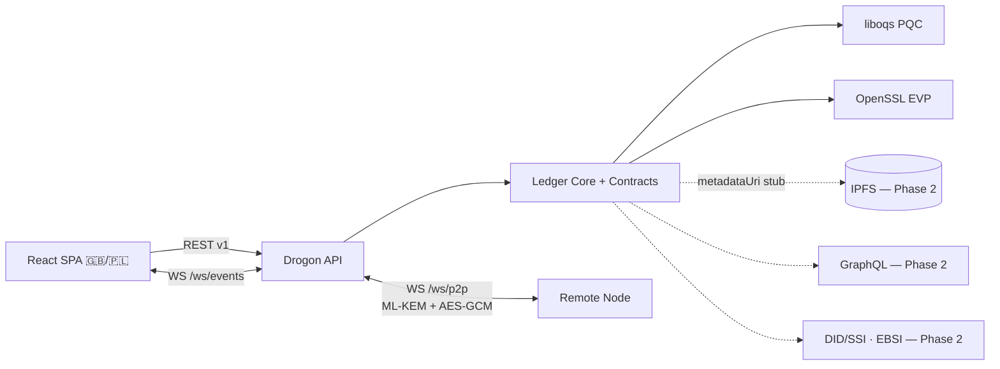

# LegalChain — Connectors & Skills (SDLC Doc 05)

**Author role:** Enterprise System Architect & Product Owner.
Integration connectors required by the C++ port of the MVP (and their evolution path), plus the AI/agent "Skills" the implementation team needs.

---

## 1. Integration connectors

### 1.1 MVP connectors (implemented now)

| Connector | Technology | Purpose | Security/compliance notes |
|---|---|---|---|
| **P2P node channel** | Drogon `WebSocketController` (`/ws/p2p`) + Drogon `WebSocketClient`, mining offloaded to a `std::jthread` | Full-ledger synchronization between two remote nodes; block/tx gossip | ML-DSA-signed handshake, ML-KEM-768 session encapsulation, AES-256-GCM frames; pseudonymous fingerprints only (GDPR-clean) |
| **UI event stream** | Drogon `WebSocketController` (`/ws/events`) | Push `BLOCK_ADDED` / `TX_ADDED` / `PEER_CONNECTED` / `CHAIN_REPLACED` / `CONSENSUS_CHANGED` to the SPA for live visualization | Read-only event fan-out; no secrets in frames |
| **liboqs PQC provider** | `open-quantum-safe/liboqs`, built via CMake `FetchContent` | ML-DSA (FIPS 204) signatures, ML-KEM (FIPS 203) KEM | Vendored once at build time; the single source of PQC primitives — no hand-rolled lattice math |
| **OpenSSL EVP** | `libssl-dev` | SHA3-256 hashing, AES-256-GCM channel encryption | Standard, audited primitives for the non-PQC crypto layer |
| **REST API** | Drogon `HttpController` (JSON via jsoncpp), contract v1 (doc 03) | Commands & queries: chain, wallet, NFT, contracts, consensus, P2P control | CORS restricted to SPA origin; input validation on every mutation |
| **i18n connector** | `GET /api/i18n/{lang}` ← `messages_en.json` / `messages_pl.json` | Serves both dictionaries backing the mandatory 🇬🇧/🇵🇱 flag switcher | Both languages ship in one artifact; no external translation service |
| **IPFS connector (stub)** | `metadataUri` field on NFT mint | NFT metadata reference by CID/URI; MVP stores the URI on-chain only | Off-chain metadata keeps personal data & large payloads off the ledger (GDPR) |

### 1.2 Phase-2+ connectors (designed for, not implemented)

| Connector | Technology | Trigger to adopt |
|---|---|---|
| **IPFS (real)** | `go-ipfs`/Kubo HTTP API via a small C++ HTTP client | NFT metadata pinning & retrieval instead of URI stub |
| **GraphQL** | e.g. `graphql-cpp` or a thin GraphQL gateway in front of the REST API | When frontend needs flexible ledger queries (per-address history, contract state slices) |
| **gRPC** | `grpc` C++ + protobuf | >2 nodes or cross-language peers; streaming block gossip at scale |
| **DID/SSI wallet** | W3C DID + Verifiable Credentials (EUDI Wallet / eIDAS 2.0) | Replace fingerprint pseudonyms with standards-based self-sovereign identity |
| **EBSI** | European Blockchain Services Infrastructure APIs | Diploma/credential verification use case goes beyond educational mock |
| **ZKP library** | e.g. `libsnark`/`arkworks` FFI bindings | Upgrade ZKP-*style* pseudonymous auth to actual zero-knowledge proofs (voting, consent) |
| **Persistence** | SQLite/RocksDB snapshotting | Chain survives node restarts; audit-grade retention |

## 2. Agent "Skills" (AI capabilities for the implementation team)

Reusable, scoped skill definitions — each maps to a recurring engineering activity in this project. (Course tip: after a working session that exercises one of these, distill it into a real Claude Code skill.)

| Skill | Scope |
|---|---|
| `quantum-crypto-engineering` | Selecting/wiring NIST PQC primitives via liboqs: ML-DSA/ML-KEM algorithm IDs and parameter sets, OpenSSL EVP for hashing/AEAD, GCM nonce discipline; reviewing crypto code for misuse (key reuse, nonce reuse, unauthenticated handshakes). |
| `drogon-ledger-management` | Drogon idioms for ledger nodes: controller/macro routing, WebSocketController endpoints, thread-safe mempool/chain (`std::mutex`), REST contract v1 conformance, CMake `FetchContent` dependency wiring. |
| `react-dapp-visualization` | Building the live ledger UI: WS-driven state, animated block/hash linkage, consensus/PQC educational components, accessible accordions/tooltips (reused unmodified from the Java port's frontend). |
| `consensus-simulation` | Implementing/verifying Strategy-pattern consensus (PoW difficulty tuning, PoS weighted selection, BFT quorum simulation) and authoring accurate encyclopedia content for the 9 mechanisms. |
| `compliance-audit` | Checking GDPR (no personal data on-chain), eIDAS 2.0 (SSI trajectory), MiCA (closed-loop token) claims against the actual code; writing the "why this is compliant" header comments. |
| `i18n-content-authoring` | Maintaining parallel EN/PL dictionaries and long-form educational texts; enforcing identical key sets; quality Polish technical translation for the flag switcher requirement. |

## 3. Connector topology

