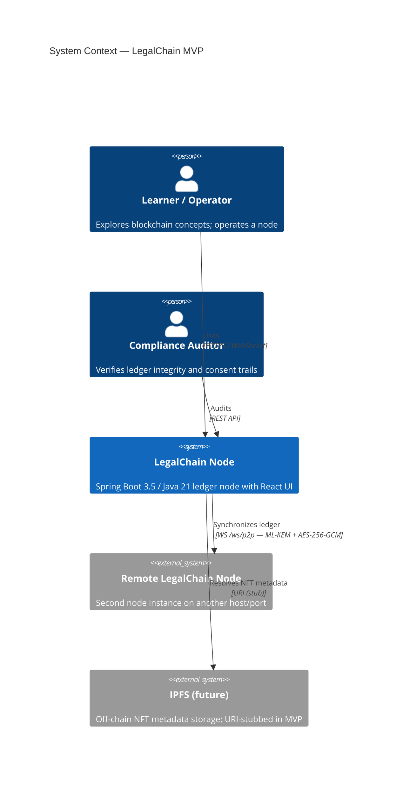
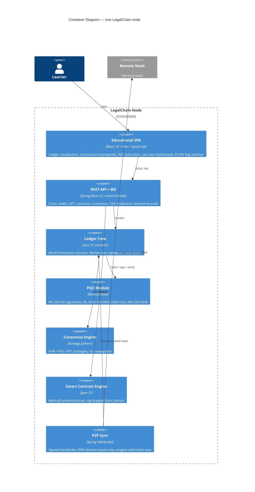
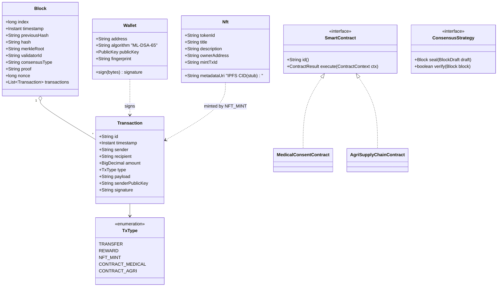
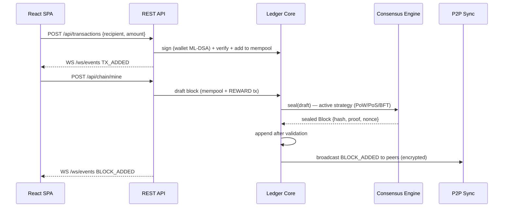

# LegalChain — System Architecture (SDLC Doc 01)

**Product:** LegalChain — a compliant, educational Blockchain 3.0 MVP (general ledger, NFT, Smart Contracts, PQC)
**Author role:** Enterprise System Architect & Product Owner
**Status:** Approved for implementation
**Mandatory cross-cutting requirement:** the UI ships with a PL/EN language switcher (🇬🇧/🇵🇱 flag toggle) — see [04-frontend-requirements.md](04-frontend-requirements.md).

### Implementation notes (Python/Django)

This `app04_python_django_block` variant implements the same architecture on **Python 3.14 / Django 6 + Channels + Daphne (ASGI)** with frozen dataclasses for the domain, a single `ledger` app holding in-memory state (no DB models), pure-Python NIST PQC packages (`dilithium-py` for ML-DSA-65, `kyber-py` for ML-KEM-768) plus `cryptography` for AES-256-GCM and `hashlib` for SHA3-256, and Channels WebSocket consumers (`runserver` serves WebSockets). Configuration lives in the `LEGALCHAIN` dict of `settings.py` with env-var overrides (e.g., `LEGALCHAIN_NODE_NAME`). Ports: node-A **8110**, node-B **8111**, Vite frontend dev server **5176**. Where diagrams or text below mention Spring Boot / Java 21 / BouncyCastle / virtual threads / `--server.port=8080/8081`, read Django 6 + Channels / Python 3.14 / dilithium-py + kyber-py / async consumers + background threads / `manage.py runserver 8110/8111`.

---

## 1. System Context

LegalChain is an educational, functional (non-mock) distributed general ledger demonstrating Blockchain 3.0 concepts — post-quantum cryptography, pluggable consensus, Smart Contracts for regulated sectors (medicine, agriculture), NFT-based ownership certification, and privacy-preserving two-node synchronization.



### 1.1 Compliance drivers

| Regulation | Architectural consequence |
|---|---|
| **GDPR** | No personal data on-chain. Medical contracts store *consent decisions and hashes*, never patient history payloads. Right-to-erasure is preserved because on-chain records are pseudonymous references to off-chain data. |
| **eIDAS 2.0** | Wallet identity is designed to map onto SSI/DID (EUDI Wallet) in a later phase; MVP uses ML-DSA key fingerprints as pseudonymous identifiers. |
| **MiCA** | The token is a closed-loop *utility/educational* token (no fiat on/off ramp), keeping the MVP outside licensable crypto-asset service scope while demonstrating compliant tokenomics (capped supply, transparent issuance). |
| **NIS2 / cybersecurity** | NIST-standardized PQC (FIPS 203/204), authenticated encrypted channels, deterministic auditability of every state change. |

## 2. Container & Component Architecture



### 2.1 Technology decisions (ADR summary)

| Decision | Choice | Rationale |
|---|---|---|
| Language/runtime | **Python 3.14 (frozen dataclasses, asyncio + threading)** | Immutable domain via frozen dataclasses = tamper-evidence by construction; async Channels consumers plus background-thread WS client give cheap per-connection concurrency for P2P and WS fan-out. |
| Framework | **Django 6 + Channels + Daphne (ASGI)** | Production-grade web framework; Channels adds first-class WebSocket consumers served directly by `runserver`. |
| PQC | **dilithium-py + kyber-py (ML-DSA, ML-KEM)** | Pure-Python NIST reference implementations of FIPS 204 / FIPS 203 — slower than BouncyCastle/liboqs, but dependency-light and readable for education. |
| Frontend | **React 18 + Vite + TypeScript** | See justification in doc 04. |
| Transport | **WebSockets** (REST for commands) | Full-duplex ledger events; gRPC deferred (doc 05). |
| Persistence | **In-memory chain (MVP)** | Educational focus; the chain itself is the audit log. File/DB snapshotting is a Phase-2 item. |

## 3. Data Model (core domain)



Design invariants:

- **Immutability:** all domain types are Java records; a block's `hash` covers `index‖timestamp‖previousHash‖merkleRoot‖validatorId‖nonce`, so any mutation invalidates the chain.
- **Merkle root:** transactions are Merkle-hashed (SHA3-256) so a single transaction cannot be altered without changing the block hash.
- **Every state change is a transaction:** NFT mints and contract executions are recorded as typed transactions — the ledger *is* the audit trail (transparency requirement).

## 4. Security Architecture

### 4.1 Cryptographic suite

| Purpose | Algorithm | Standard | Why quantum-safe |
|---|---|---|---|
| Transaction & handshake signatures | **ML-DSA-65 (Dilithium)** | NIST FIPS 204 | Module-lattice problems (MLWE/MSIS) have no known efficient quantum attack, unlike ECDSA (broken by Shor's algorithm). |
| Session key establishment | **ML-KEM-768 (Kyber)** | NIST FIPS 203 | Lattice-based KEM; defeats "harvest-now, decrypt-later" against recorded traffic. |
| Hashing / Merkle / addresses | **SHA3-256** | FIPS 202 | Grover's algorithm only halves effective strength → 128-bit post-quantum security. |
| Channel encryption | **AES-256-GCM** | FIPS 197 / SP 800-38D | 256-bit key retains 128-bit strength vs Grover; GCM adds integrity. |

### 4.2 P2P handshake (QKD-inspired, MITM-resistant)

The design borrows QKD's core discipline — *fresh, ephemeral session keys whose establishment is verifiable by both parties* — implemented with ML-KEM (software lattice KEM rather than photonic hardware):

```mermaid
sequenceDiagram
    participant A as Node A (initiator)
    participant B as Node B (responder)
    Note over A,B: WS /ws/p2p — plaintext only during authenticated handshake
    A->>B: HELLO {nodeId, mlkemPubKey, mldsaPubKey, sig = ML-DSA(nodeId‖mlkemPubKey)}
    B->>B: verify sig against mldsaPubKey; pin fingerprint (TOFU)
    B->>A: ENCAP {ciphertext = ML-KEM.encap(mlkemPubKey), mldsaPubKey_B, sig_B}
    A->>A: sharedSecret = ML-KEM.decap(ciphertext) → HKDF → AES-256-GCM key
    B->>B: sharedSecret (same) → AES-256-GCM key
    A->>B: CONFIRM {AES-GCM(nonce, "confirm"‖transcriptHash)}
    Note over A,B: All further frames AES-256-GCM encrypted; new key per session (forward secrecy)
    A->>B: CHAIN_REQUEST (encrypted)
    B->>A: CHAIN_RESPONSE (encrypted; every block re-validated on receipt)
```

**MITM resistance:** every handshake message is signed with ML-DSA over the transcript, so an interceptor cannot substitute its own KEM key without breaking the signature. **Privacy preservation (ZKP-style):** nodes authenticate as *key fingerprints* (pseudonyms) — each party proves possession of a private key (via signature) without revealing any real-world identity, which is the trust-without-disclosure property the user stories in doc 02 (Epic E4) require.

### 4.3 Threat model (STRIDE excerpt)

| Threat | Vector | Mitigation |
|---|---|---|
| Spoofing | Fake peer joins sync | ML-DSA-signed handshake + fingerprint pinning (TOFU) |
| Tampering | Block/transaction mutation | SHA3-256 chain + Merkle root + full re-validation on chain replacement |
| Repudiation | Actor denies a contract action | Every action is a signed on-chain transaction |
| Information disclosure | Traffic capture; **harvest-now-decrypt-later** | ML-KEM-768 + AES-256-GCM; per-session ephemeral keys |
| MITM | Key substitution during handshake | Signatures over full handshake transcript (§4.2) |
| Denial of service | WS flood | Virtual-thread isolation, message size caps (Phase 2: rate limiting) |
| Consensus abuse | Malicious validator | BFT strategy tolerates f < n/3 faults; PoS slashing is documented in doc 03 |

## 5. Deployment topology (MVP)

Two identical Spring Boot instances (`--server.port=8080` / `--server.port=8081`), each serving its own SPA and wallet; peered via `POST /api/p2p/connect`. Longest-valid-chain rule resolves divergence. See doc 03 §Node Management.

## 6. Block lifecycle



## 7. Traceability

- Requirements → [06-implementation-checklist.md](06-implementation-checklist.md)
- Epics & stories → [02-epics-user-stories.md](02-epics-user-stories.md)
- Backend spec & API contract → [03-backend-requirements.md](03-backend-requirements.md)
- Frontend spec (incl. PL/EN flag switcher) → [04-frontend-requirements.md](04-frontend-requirements.md)
- Connectors & skills → [05-connectors-and-skills.md](05-connectors-and-skills.md)
